# CÔNG NHẬN TÀI NGUYÊN SỬ DỤNG

## ÂM NHẠC
Các bản nhạc sau thuộc bản quyền của **ZUN (Team Shanghai Alice)**, được sử dụng trong game với mục đích **phi thương mại**:
- A Dream that is more Scarlet than Red - - Touhou Koumakyou ~ The Embodiment of Scarlet Devil.
- The Centennial Festival for Magical Girls - Touhou Koumakyou ~ The Embodiment of Scarlet Devil.
- U.N. Owen Was Her? - Touhou Koumakyou ~ The Embodiment of Scarlet Devil.

**Trang web chính thức**: [web](https://www16.big.or.jp/~zun/)

## HÌNH ẢNH/NHÂN VẬT
- Thiết kế nhân vật dựa trên Touhou Project (ZUN)  
- Sprite link: [link](https://www.spriters-resource.com/pc_computer/touhoukoumakyoutheembodimentofscarletdevil/)

---

#  ĐIỀU KHOẢN SỬ DỤNG
- Bạn **không được phép bán hay phân phối lại** sản phẩm này.  
- Đây là project bài tập của sinh viên, không được dùng cho mục đính thương mại.
- Tuân thủ [Hướng dẫn của ZUN cho fan-work](https://en.touhouwiki.net/wiki/ZUN%27s_guidelines_for_fan_works). 

---

# Touhou Touhou Koumakyou ~ The Embodiment of Scarlet Devil (HMD edition)

Download link: [Tải tại đây](https://drive.google.com/drive/folders/1WGBy4llzN4hkpyrL9SvCHxuKzkXIuGa9?usp=sharing).

Vid: [vid](https://youtu.be/wKH3GsBdyhg).
---

# Giới thiệu game

Đây là bản fanmade được lấy cảm hứng từ Touhou 6: The Embodiment of Scarlet Devil.  
Game thuộc thể loại **danmaku (bullet hell)** – nơi bạn phải né tránh hàng loạt đạn bay chi chít và tiêu diệt kẻ địch với nhân vật chính.  
Mục tiêu của bạn là sống sót, tiêu diệt boss, thu thập item và đạt điểm số cao nhất có thể.  
Game có các cơ chế như **graze**, **spellcard**, **auto-collection**, **item tăng sức mạnh**... giúp người chơi cảm nhận đầy đủ không khí Touhou chính hiệu.

---

## Menu

Khi vào game, bạn sẽ thấy giao diện menu đơn giản như Touhou 6 với các lựa chọn:

### **Màn hình chính**
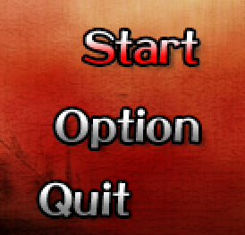

- **Start** – Bắt đầu game
- **Option** – Tùy chỉnh âm thanh
- **Quit** – Thoát game

---

### **Tùy chỉnh âm lượng**
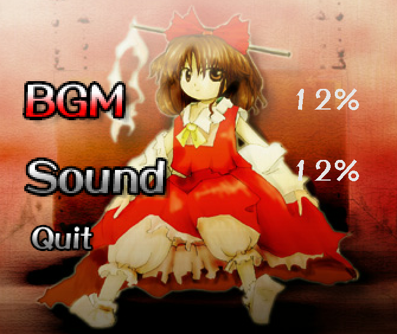

- **BGM** – Nhạc nền
- **Sound** – Âm thanh hiệu ứng

Bạn có thể điều chỉnh âm lượng từng mục bằng phím trái/phải.

---

### **Màn hình chiến thắng**
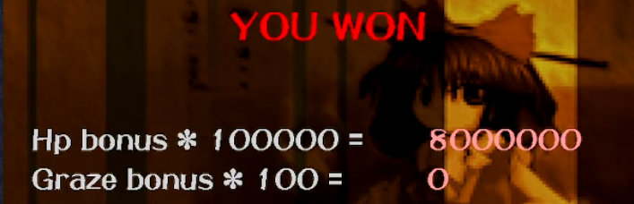

Sau khi thắng boss cuối, bạn sẽ thấy màn hình thống kê:
- **HP Bonus**
- **Graze Bonus**

Toàn bộ sẽ cộng vào score của bạn.

---

# Di chuyển

- **WASD**: Lên / Trái / Phải / Xuống  
- **Space**: Bắn  
- **Shift**: Focus (Tập trung, di chuyển chậm, hiện hitbox)

### So sánh giữa thường và Focus:
Khi bắt đầu game, nhân vật của bạn sẽ có:

- 1.00 Power – mức sức mạnh khởi điểm để bạn có thể tấn công cơ bản.

- 4 HP tổng cộng – bao gồm:

   * 1 HP hiện tại (đang dùng).
   * 3 HP lưu trữ, sẽ được sử dụng dần khi bạn mất mạng.

Hệ thống này khuyến khích người chơi giữ mạng càng lâu càng tốt để đạt điểm số cao, đồng thời tạo cơ hội hồi phục thông qua item Heal và các phần thưởng khác.
Trong mode focus, nhân vật sẽ hiển thị hitbox  và di chuyển chậm rãi để dễ dàng né hơn.

| Normal | Focus |
|--------|-------|
|  | 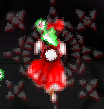 |

---

# Thanh thông số

Hiển thị hình ảnh nhân vật (HP, power v.v):  
| 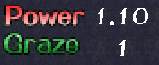 | Sức mạnh và graze |
|---|---|
|  | Máu còn lại |
| 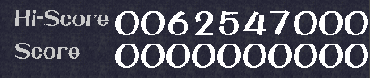 | Kỉ lục và hiện tại |

---

# Một số cơ chế game

### **Graze**
Khi đạn bay sát người chơi (nhưng không trúng), bạn sẽ được tăng graze.  
Graze sễ làm tăng giá trị của Item bạn nhận được.
Càng nhiều graze thì giá trị càng tăng;

### **Hitbox nhỏ nên đừng sợ đạn**

Tất cả viên đạn đều có hitbox nhỏ hơn nhiều so với sprite, nên bạn có thể né cực sát nếu tinh mắt và bình tĩnh.  
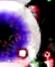

---

### **Các item**

| Item | Mô tả |
|------|-------|
|  | **Full Power** – Tăng sức mạnh lên tối đa |
|  | **Heal** – Hồi máu |
|  | **Point** – Tăng điểm |
|  | **Power** – Tăng sức mạnh |
|  | **Star** - Điểm xóa đạn |

---

### **Auto Collection**

Phía trên màn hình chơi có một vùng. Khi nhân vật bay vào đó, các item sẽ tự động bị hút về.  
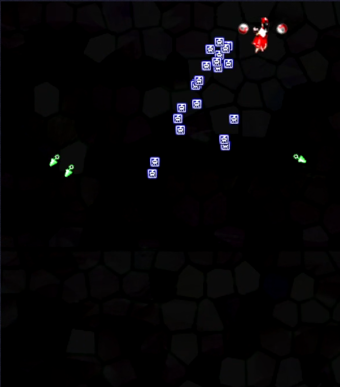

---

### **Boss**

#### Trong trận đấu boss, bạn sẽ thấy một thanh HUD hiển thị ở phía trên màn hình, bao gồm (từ trái sang phải):
- 🏷️ Tên boss
- ✴️ Số lượng Spellcard còn lại
- ❤️ Thanh máu của boss
- ⏱️ Thời gian còn lại 
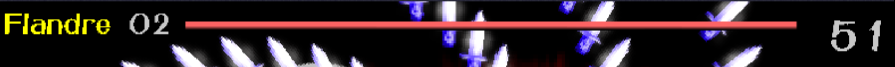

#### Khi bạn phá xong một thanh máu của boss:
- Mọi đạn trên màn hình sẽ bị xóa.
- Bạn sẽ nhận được một **Star Item** để tăng điểm cho mỗi viên đạn được xóa.  
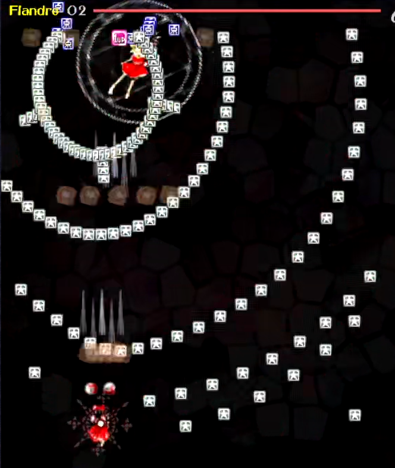

#### Spellcard

+ Boss sẽ sử dụng **Spellcard** – những đòn tấn công đặc biệt có giới hạn thời gian.  
+ Nếu bạn tiêu diệt boss **trong thời gian quy định**, bạn nhận thêm **điểm thưởng lớn**.  
+ Nếu hết giờ mà chưa tiêu diệt xong thì chỉ chuyển pha, không có bonus.
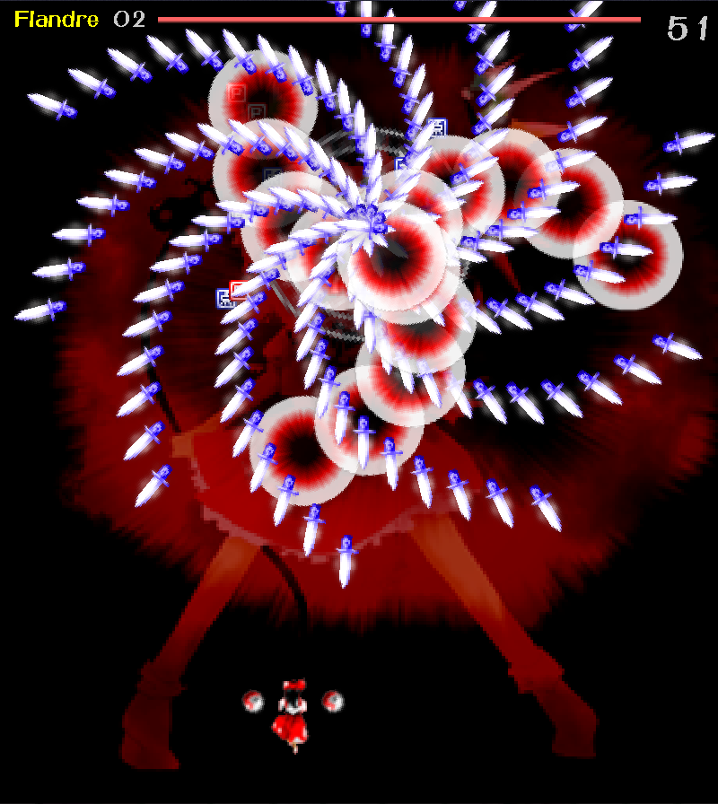

---

## 📁 Tệp mã nguồn

#### `1. Game.cpp`
- **Mục đích:** Quản lý vòng lặp chính của trò chơi.
- **Chức năng chính:**
  - Khởi tạo SDL, texture và âm thanh.
  - Quản lý các đối tượng như người chơi, kẻ địch, đạn và vật phẩm.
  - Xử lý chuyển trạng thái: `LOADING`, `MENU`, `PLAYING`, `PAUSE`, `EXIT`.

#### `2. Player.cpp`
- **Mục đích:** Triển khai hành vi của nhân vật người chơi.
- **Chức năng chính:**
  - Xử lý đầu vào (di chuyển, bắn).
  - Cập nhật vị trí, hoạt ảnh, và vùng va chạm.
  - Quản lý máu, cấp sức mạnh, và đếm số lần tránh đạn.

#### `3. Enemy.cpp`
- **Mục đích:** Định nghĩa hành vi và hiển thị của kẻ địch.
- **Chức năng chính:**
  - Di chuyển theo mẫu định sẵn.
  - Bắn theo các kiểu: ngẫu nhiên, nhắm, vòng tròn.
  - Quản lý máu và loại kẻ địch.

#### `4. Boss.cpp`
- **Mục đích:** Quản lý hành vi và giai đoạn của trùm.
- **Chức năng chính:**
  - Di chuyển, hoạt ảnh và mẫu bắn.
  - Quản lý giai đoạn thường và spellcard.
  - Cập nhật máu và chuyển giai đoạn.

#### `5. EnemyLayout.cpp`
- **Mục đích:** Sinh và bố trí kẻ địch theo tiến trình màn chơi.
- **Chức năng chính:**
  - Sinh địch tại thời điểm và vị trí cụ thể.
  - Xử lý bắn và tương tác với người chơi.
  - Chuyển sang trận đấu trùm.

#### `6. Bullets.cpp`
- **Mục đích:** Quản lý hành vi của đạn.
- **Chức năng chính:**
  - Cập nhật vị trí và kiểm tra va chạm.
  - Quản lý tốc độ, hướng, loại đạn.

#### `7. Items.cpp`
- **Mục đích:** Xử lý các vật phẩm có thể thu thập.
- **Chức năng chính:**
  - Cập nhật vị trí và va chạm với người chơi.
  - Quản lý loại và hiệu ứng vật phẩm.

#### `8. Collision.cpp`
- **Mục đích:** Kiểm tra va chạm giữa các đối tượng.
- **Chức năng chính:**
  - Xử lý va chạm giữa đạn, kẻ địch, người chơi, vật phẩm.
  - Cập nhật trạng thái dựa trên kết quả va chạm.

#### `9. Menu.cpp`
- **Mục đích:** Triển khai menu chính và giao diện người dùng.
- **Chức năng chính:**
  - Điều hướng menu, nhận input.
  - Hiển thị menu và chuyển trạng thái trò chơi.

#### `10. Sidebar.cpp`
- **Mục đích:** Hiển thị thông tin người chơi khi đang chơi.
- **Chức năng chính:**
  - Hiển thị máu, điểm, sức mạnh.
  - Cập nhật động theo trạng thái trò chơi.

#### `11. ScoreManager.cpp`
- **Mục đích:** Quản lý điểm số và điểm cao.
- **Chức năng chính:**
  - Cập nhật điểm hiện tại.
  - Đọc/ghi điểm cao từ tệp.

#### `12. TextureManager.cpp`
- **Mục đích:** Tải và hiển thị texture.
- **Chức năng chính:**
  - Tải từ tệp, dọn dẹp.
  - Cung cấp hàm hỗ trợ để hiển thị texture lên màn hình.

---

### 📁 Tệp tiêu đề (Header Files)

| Tệp               | Mục đích                                                                 |
|--------------------|-------------------------------------------------------------------------|
| `Game.hpp`         | Khai báo lớp Game, định nghĩa trạng thái và logic chính.              |
| `Player.hpp`       | Khai báo lớp Player và các phương thức của nó.                        |
| `Enemy.hpp`        | Khai báo lớp Enemy và các thuộc tính/phương thức.                     |
| `Boss.hpp`         | Khai báo lớp Boss và điều khiển giai đoạn.                            |
| `EnemyLayout.hpp`  | Khai báo lớp quản lý bố trí kẻ địch.                                   |
| `Bullets.hpp`      | Khai báo lớp Bullet.                                                   |
| `Items.hpp`        | Khai báo lớp Item.                                                     |
| `Collision.hpp`    | Khai báo lớp CollisionCheck cho việc kiểm tra va chạm.                |
| `Menu.hpp`         | Khai báo lớp Menu cho giao diện chính.                                |
| `Sidebar.hpp`      | Khai báo lớp Sidebar hiển thị thông tin người chơi.                   |
| `ScoreManager.hpp` | Khai báo lớp quản lý điểm số và điểm cao.                             |
| `TextureManager.hpp`| Khai báo lớp TextureManager xử lý việc tải/hiển thị texture.         |

---

